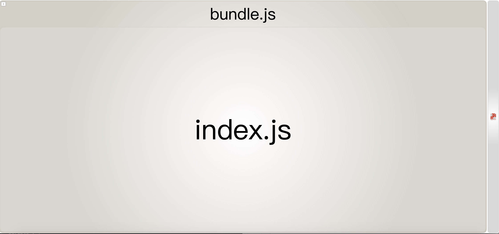
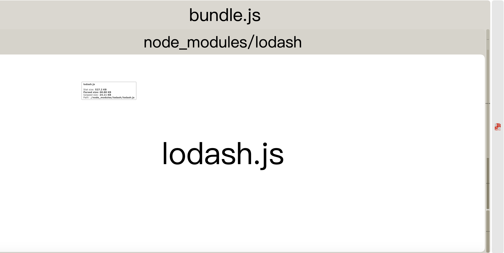
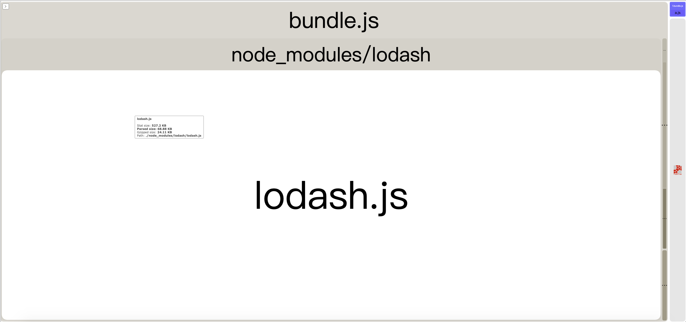
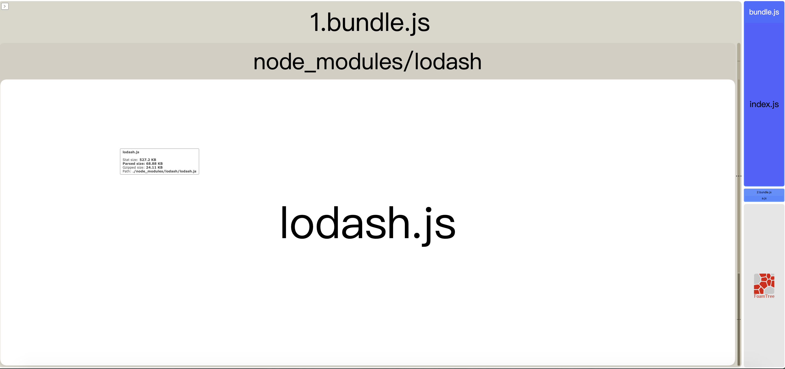
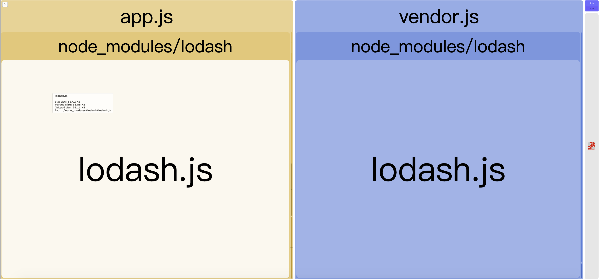
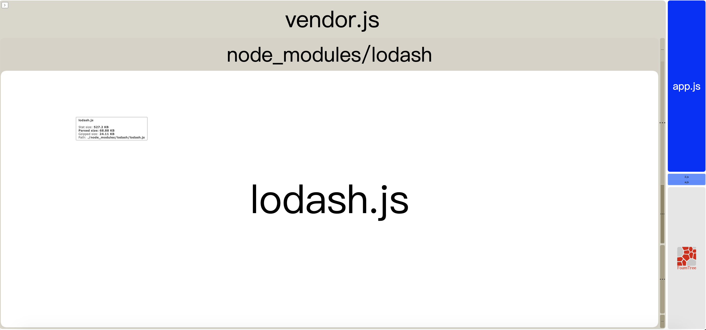
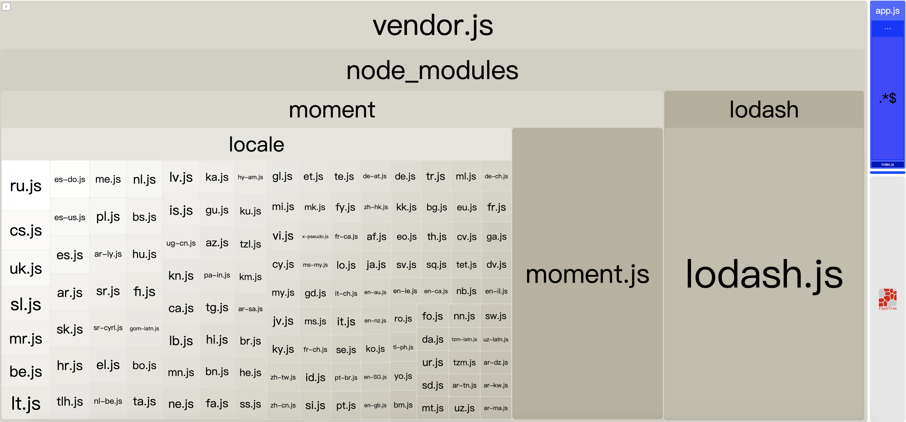
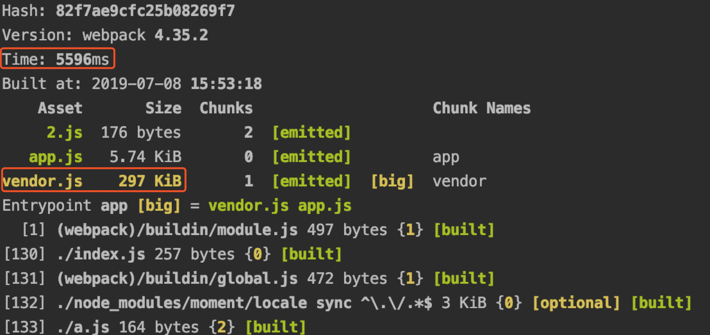
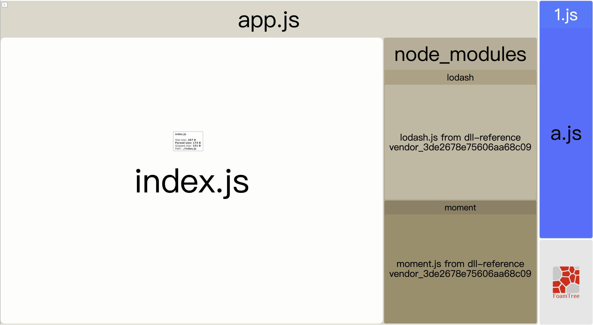

# webpack探索---打包优化

在上一篇文章中，[从零搭建一个项目](https://juejin.im/post/5cc580215188257feb01cad8)，主要记录一些基本的配置。但是并没有重视打包构建方面的优化，由于自己用上一篇文章的配置开发的一个项目后打包后的文件过大导致项目运行速度也很低，所以今天着重学习一下一些打包的概念和优化配置。

## 创建项目&基本的打包配置

初始化项目、安装依赖：

```
mkdir webpack-build-enhance
cd webpack-build-enhance
npm init
npm i -D webpack webpack-cli cross-env
```

创建 index.js，添加测试代码：

```
let test = 'test';

console.log(test);
```

创建 webpack.config.js，打包配置：

```
const path = require('path');

const config = {
    mode: 'production',
    entry: './index.js',
    output: {
        filename: 'bundle.js',
        path: path.resolve(__dirname, './dist/')
    }
};

module.exports = config;
```

运行`npm run build`测试打包结果，第一步 done！

注：这篇文章主要关心打包，开发环境的 webpack 配置就不多讲啦。

## 配置webpack-bundle-analyzer

为了更加清晰的看到打包之后各个模块的大小以及关系，借助 `webpack-bundle-analyzer` 插件，可以生成代码分析报告，帮助提升代码质量和网站性能。

安装：

```bash
npm i -D webpack-bundle-analyzer
```

配置：

```js
// 引入
const BundleAnalyzerPlugin = require('webpack-bundle-analyzer').BundleAnalyzerPlugin;

// 配置
plugins: [
  new BundleAnalyzerPlugin(
    {
      analyzerMode: 'server',
      analyzerHost: '127.0.0.1',
      analyzerPort: 8889,
      reportFilename: 'report.html',
      defaultSizes: 'parsed',
      openAnalyzer: true,
      generateStatsFile: false,
      statsFilename: 'stats.json',
      statsOptions: null,
      logLevel: 'info'
    }
  )
]
```

然后运行`npm run build`后，访问`http://127.0.0.1:8889/`就可以看到分析报告了。



可以看到，输出只有一个js模块bundle.js，bundle.js中的内容也只有一个简单的index.js。

为了使代码看起来复杂一点，引入 `lodash`。

```
npm i -S lodash
```

index.js 修改为:

```
const _ = require('lodash');

_.camelCase('Test Module');
// => 'testModule'

_.camelCase('--test-module--');
// => 'testModule'

_.camelCase('__TEST_MODULE__');
// => 'testModule'
```

运行`npm run build`查看打包结果，可以看到 bundle.js 中包含了第三方依赖的 lodash.js。



这样做的缺点：将第三方模块的代码和业务代码杂糅到了一起。当需求不断添加更改的过程中，业务代码会不断修改，但第三方库基本是稳定不变的。所以分离第三方库，借助浏览器的缓存，避免布版本，用户每次发都需要重新加载这些稳定不变的第三方库。

## 代码分离 Code Splitting

webpack 的[代码分离](https://webpack.docschina.org/guides/code-splitting/)有三种方法：

- 入口起点：使用 [`entry`](https://webpack.docschina.org/configuration/entry-context) 配置手动地分离代码。
- 防止重复：使用 [`SplitChunksPlugin`](https://webpack.docschina.org/plugins/split-chunks-plugin/) 去重和分离 chunk。
- 动态导入：通过模块中的内联函数调用来分离代码。

第一种方法就不说了，第二种方法在后面会讲到，这里先学习一下第三种。

### 动态导入： webpack 针对动态导入的默认代码分离打包规则

webpack 针对动态导入（按需加载）所使用的默认代码分离打包规则：

- 新代码块可以被共享引用，或者这些模块都是来自node_modules文件夹里面
- 新代码块大于30kb（min+gziped之前的体积）
- 按需加载的代码块，并行请求最大数量应该小于或者等于5
- 初始加载的代码块，并行请求最大数量应该小于或等于3

> 默认情况下只会影响按需加载模块，因为对初始块也进行优化打包会影响HTML中的script标签数，增加请求数。

首先，创建 a.js：

```
console.log('moduleA');
```

index.js 末尾中添加 ：

```
import('./a.js');
```

运行`npm run build`：



可以看到 有两个output，bundle.js 和 1.bundle.js，很小的那个紫色块。说明 webpack 对动态导入的 a.js 自动进行了代码分离，单独打包成为一个模块。这里有一个点，`lodash`是直接打包到 bundle.js 中的，后面会依次分析。

接下来尝试在 a.js 中添加 `lodash`的引用并使用。

```
const _ = require('lodash');

_.camelCase('Module A');
// => 'moduleA'

_.camelCase('--module-a--');
// => 'moduleA'

_.camelCase('__MODULE_A__');
// => 'moduleA'
```

这个时候的打包和上一步的打包结果基本是一致，虽然在动态导入的 a.js 中也引入了`lodash`，但是这里打包没有做过多处理，是因为在入口文件中已经使用到了 `lodash`，在下一级会一起共用，并且映照了动态引入的代码分离方式，不会对入口文件进行处理的规则。

接下来尝试，将 index.js 中的 `lodash`暂时去掉，只剩动态引入 a.js 的代码，打包结果如下：



可以看到，现在有三个输出文件，bundle.js、1.bundle.js 和 2.bundle.js。其中 1.bundle.js 只包含了 `lodash`，这里则遵守了第一条规则，针对动态引入模块中可以共享或者是来自 node_modules 中的模块，会进行代码分离打包。

### 防止重复

回到上一步，在 index.js 中恢复对 `lodash`的引用，可以看到`lodash`并没有被分离打包。这个时候就需要使用分离 vendor的方式进行代码分离。

#### 分离 vendor

修改 entry 和 output：

```
entry: {
	app: './index.js',
	vendor: ['lodash']
},
output: {
	filename: '[name].js',
	path: path.resolve(__dirname, './dist/')
}
```

运行`npm run build`访问`http://127.0.0.1:8889/`查看打包结果：



可以看到，现在有三个输出 app.js、vendor.js 和 2.js。第三方依赖的模块`lodash`已经分离出来作为一个单独的 entry chunk。但 app.js 和 vendor.js 都包含了 lodash，实际上并没有将依赖第三方的模块进行分离打包。

关于这一步的解释，可以参考[Webpack 大法之 Code Splitting](https://zhuanlan.zhihu.com/p/26710831)。

把公共的依赖提取公共模块来解决这一问题，在 webpack 4 之前，借助`CommonsChunkPlugin`这个插件，webpack 4 移除了这个插件，需要使用 `optimization.splitChunks`。

#### 配置optimization.splitChunks

webpack.config.js 中添加配置：

```
optimization: {
    splitChunks: {
        chunks: 'all',
        cacheGroups: {
            vendor: {
                name: 'vendor',
                chunks: 'initial'
            }
        }
    }
}
```

运行`npm run build`，可以看到，`lodash`被打包到了 vendor.js 下，app.js 中不包括 `lodash`，app.js 体积大大减小，达到了提取公共模块的目的。




#### 自动分离vendor

在上面分离 vendor 的时候，通过手写的方式配置。那么如果我们有更多的依赖，就要不断的添加，怎么配置自动分离vendor呢？

easy～

首先为了测试，再安装一个依赖：

```
npm i -S moment
```

index.js 中添加测试代码：

```
const moment = require('moment');
console.log(moment());
```

然后再 webpack.config.js 中配置：

```
// 删除 entry 中的 vendor
entry: {
	app: './index.js'
},
optimization: {
	splitChunks: {
		chunks: 'all',
		cacheGroups: {
			vendor: {
				// 使用正则匹配所有加载路径为 node_modules 路径下的模块
				test: /[\\/]node_modules[\\/]/,
				name: 'vendor'
			}
		}
	}
}
```

然后运行`npm run build`可以看到`moment`和`lodash`都被打包到 vendor.js中了，自动化分离代码实现啦～✌️



每次打包文件名输出一样，导致浏览器缓存无法访问最新的文件，为了解决这个问题，通常会为输出文件添加 hash 的方式解决。

另一个问题是，每次打包都会重新打包第三方依赖，尽管第三方依赖没有变动。这样不仅导致打包速度降低，由于 hash 的更新，浏览器每次还要重新加载  vendor，造成不必要的性能浪费。

为了解决上面的问题就需要使用到 `DLL`了。

## DLL

`DLL`相对于`Code Splitting`的优点是，通过打包第三方依赖库，在第三方依赖没有更新的情况下，不对第三方依赖进行重复打包而提升打包的速度，并且更合理的使用浏览器缓存，提升加载速度。

在配置`DLL`之前，打包速度为 **5596ms**，每次打包也对 vendor.js 进行了重新打包。




### DLL 基本配置

`DLL`主要依靠两个插件：`DLLPlugin` 和 `DllReferencePlugin`。

> windows 系统中，.dll后缀的文件表示**动态链接库**，在一个动态链接库中可以包含给其他模块调用的函数和数据。
>
> 参考：[《深入浅出webpack》4-2 使用 DllPlugin](http://www.xbhub.com/wiki/webpack/4优化/4-2使用DllPlugin.html)

参考《深入浅出webpack》中对这两个插件的总结：

- DllPlugin 插件：用于打包出一个个单独的动态链接库文件。
- DllReferencePlugin 插件：用于在主要配置文件中去引入 DllPlugin 插件打包好的动态链接库文件。

emm….懂了吗？

并没有。

通俗点说：

- DLLPlugin：把第三方库代码分离，并且每次打包时，如果第三方依赖没有更新，则不会再重新打包第三方依赖，提升打包速度。该插件需要单独配置一个 webpack 文件 webpack.dll.config.js，配置之后会根据配置生成类似于 vendor.dll.js 和 manifest.json 文件。vendor.dll.js 中包含了所有第三方依赖文件，manifest.json 中则包含所有第三方依赖库的索引，对第三方依赖库做一个映射。
- DllReferencePlugin：根据 manifest.json 中的索引检查第三方依赖是否存在，根据 manifest.json 中的映射，把依赖的名称映射到模块的 id 上，之后再在需要的时候通过内置的 `__webpack_require__` 函数引入对应的依赖。

配置 webpack.dll.config.js：

```
const path = require('path');
const webpack = require('webpack');

const vendors = [
    'lodash',
    'moment'
];

module.exports = {
    output: {
        path: path.resolve(__dirname, './dist/'),
        filename: '[name].[chunkhash].js',
        library: '[name]_[chunkhash]',
    },
    entry: {
        vendor: vendors,
    },
    plugins: [
        new webpack.DllPlugin({
            path: 'manifest.json',
            name: '[name]_[chunkhash]',
            context: __dirname,
        }),
    ],
};
```

package.json 中配置运行命令：

```
"dll": "cross-env NODE_ENV=production webpack --config webpack.dll.config.js"
```

运行`npm run dll`会生成 /dist/vendor.3de2678e75606aa68c09.js 和 ./manifest.json，简单查看一下 manifest.json可以看到，存储了所有依赖的路径到 id 编号的映射。

webpack.config.js 中配置`DllReferencePlugin`，删除代码分离的配置：

```
const path = require('path');
const webpack = require('webpack');
const BundleAnalyzerPlugin = require('webpack-bundle-analyzer').BundleAnalyzerPlugin;

const config = {
    mode: 'production',
    entry: {
        app: './index.js'
    },
    output: {
        filename: '[name].js',
        path: path.resolve(__dirname, './dist/')
    },
    plugins: [
        new BundleAnalyzerPlugin(
            {
                analyzerMode: 'server',
                analyzerHost: '127.0.0.1',
                analyzerPort: 8889,
                reportFilename: 'report.html',
                defaultSizes: 'parsed',
                openAnalyzer: true,
                generateStatsFile: false,
                statsFilename: 'stats.json',
                statsOptions: null,
                logLevel: 'info'
            }
        ),
        new webpack.DllReferencePlugin({
            context: __dirname,
            manifest: require('./manifest.json'),
        })
    ]
};

module.exports = config;
```

运行`npm run build`，访问`[http://127.0.0.1:8889](http://127.0.0.1:8889/)`：



打包之后的 app.js 虽然包含了 `lodash`和`moment`，但实际的代码中并不包含第三方依赖的代码，知识对其的引用。

从下图可以看到 app.js 的体积是十分小的，并且打包速度为**111ms**，相对于之前提升了很多。


### DLL 如何自动化？

如上述配置的描述，可见是非常不灵活的。如果有新的第三方依赖出现，那么就需要手动修改 webpack.dll.config.js，然后手动运行`npm run dll`命令，并且在新的依赖出现的时候很有可能忘记这一步操作，那么如何可以实现自动化的配置`DLL`呢？

借助[autodll-webpack-plugin](https://github.com/asfktz/autodll-webpack-plugin)插件就可以了，具体的原理我暂时还没看，可以参考文档进行配置。

后面学习了其中的原理之后再做更多的补充和描述。

## 参考

代码分离：[https://webpack.docschina.org/guides/code-splitting/](https://webpack.docschina.org/guides/code-splitting/)

DLL：https://webpack.docschina.org/plugins/dll-plugin/