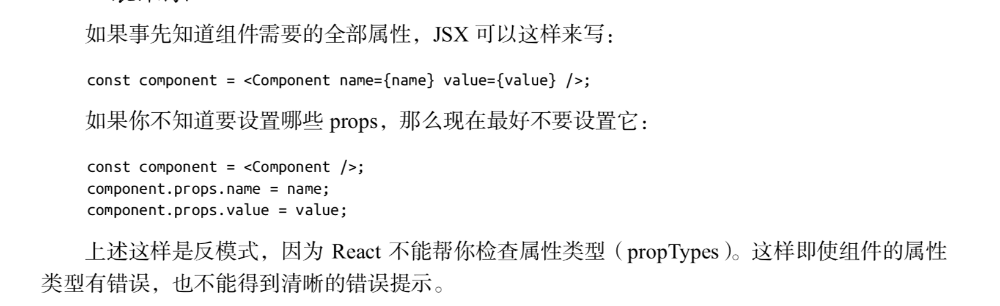
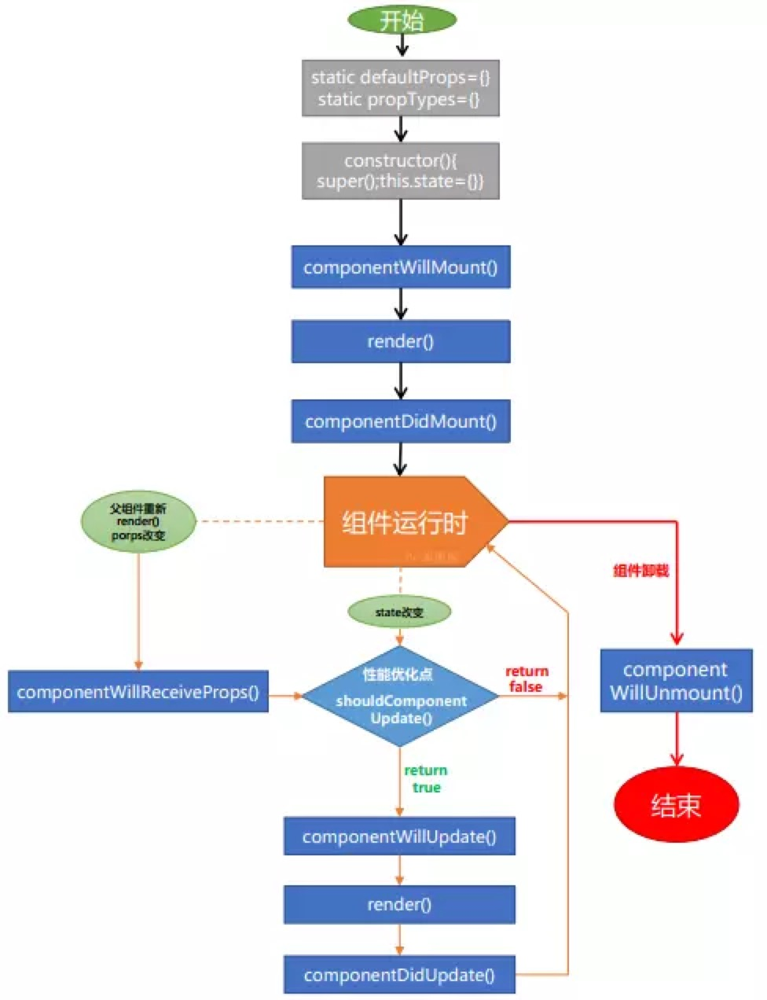

# 由 proptypes 引起的思考

首先，react 是如何实现，在开发环境 proptypes 生效，而生产环境不生效的呢？

探究一下 prop-types 的入口文件的源码就可以知道：

```
if (process.env.NODE_ENV !== 'production') {
  var ReactIs = require('react-is');

  // By explicitly using `prop-types` you are opting into new development behavior.
  // http://fb.me/prop-types-in-prod
  var throwOnDirectAccess = true;
  module.exports = require('./factoryWithTypeCheckers')(ReactIs.isElement, throwOnDirectAccess);
} else {
  // By explicitly using `prop-types` you are opting into new production behavior.
  // http://fb.me/prop-types-in-prod
  module.exports = require('./factoryWithThrowingShims')();
}
```

由上可知，react 提供了两个版本，开发版本和线上版本。开发版本会进行错误检测，包括 proptypes 的检测，但是线上版本不会检查错误。根据`process.env.NODE_ENV`环境变量区别使用哪一个版本，可以通过 envify 或者 webpack 定义环境变量达到目的。

webpack 定义环境变量的方法：

```
new webpack.DefinePlugin({
  "process.env": {
    NODE_ENV: JSON.stringify("production")
  }
});
```

在《深入浅出 React 技术栈》中看到这样一段话:


其中说到，如果使用反模式的话，React 不会检查属性类型，不能得到错误提示。

看到这里，引起了我的思考？为什么 React 就不检查了呢？两种写法有什么区别呢？

首先我想到的就是，proptypes 的检查时机可能是原因，可是经过自己的思考和查证，发现 proptypes  是运行时检查。

看一下 react 的生命周期：


注：图源自[https://juejin.im/post/5a062fb551882535cd4a4ce3](https://juejin.im/post/5a062fb551882535cd4a4ce3)

从图中可以看到，proptypes 类型检查存在于组件的生命周期之中，那么说明 proptypes 类型检查是运行时检查的。

```
let component = <Component />
component.props.value = value;
component.props.name = name;
```

上面这种写法，在给组件赋值props的时候，组件已经实例化，这种写法的props赋值出现在constructor之后，由于defaultProps、propTypes、constructor、componentDidMount这几个生命周期都只执行一次。那么在组件实例化之后赋值的props，当然不会进行类型检查。